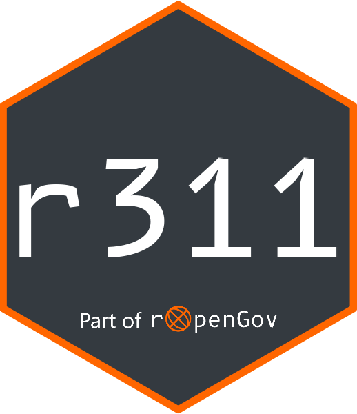

<!-- README.md is generated from README.Rmd. Please edit that file -->

```{r, include = FALSE}
knitr::opts_chunk$set(
  collapse = TRUE,
  comment = "#>",
  fig.path = "man/figures/README-",
  out.width = "100%"
)

httptest2::start_vignette("../man/figures/README")
```

# r311 

<!-- badges: start -->
[](https://ropengov.org/)
[](https://github.com/rOpenGov/r311/actions/workflows/R-CMD-check.yaml)
[](https://cran.r-project.org/package=r311)
[](https://app.codecov.io/gh/rOpenGov/r311?branch=main)
[](https://www.codefactor.io/repository/github/rOpenGov/r311)
[](https://www.repostatus.org/#active)
<!-- badges: end -->

`{r311}` is an R interface to the international standard [open311](https://www.open311.org/). Open311 APIs are used for civic issue management and public service communication. The standard allows administrations to better manage citizen requests, citizens to more easily submit requests, and (hence this package) researchers and data scientists to access data regarding public service communication. `{r311}` supports the seamless management and supplementation of available endpoints, the selection of appropriate APIs to access, and the retrieval of civic service and request data. Custom queries and extensions (e.g. from CitySDK) are implicitly supported. `{r311}` is designed to require a minimal amount of dependencies, but allow for easy integration into common R frameworks such as the tidyverse, `sf` or `xml2`.

## Installation

You can install `{r311}` from CRAN with:

```r
install.packages("r311")
```

Or you can install the development version from [GitHub](https://github.com/) with:

```r
# install.packages("remotes")
remotes::install_github("rOpenGov/r311")
```


## Example

The following example loads `{r311}`, sets up a jurisdiction and retrieves
a small amount of data on service tickets in Cologne, Germany.

```{r example}
library(r311)

o311_api("Cologne")
o311_requests()
```


## API upkeep

`{r311}` is powered by a JSON of available APIs (see [here](https://github.com/rOpenGov/r311/blob/main/inst/endpoints.json)). This list does not claim to be comprehensive nor up-to-date at all times but is updated from time to time. If an API is found to be unavailable for an extended period of time, it will be marked as "questioning". Questionable APIs will be removed on the next release.

If you know about a stable open311 API that should be added to the list, please consider opening an issue. Otherwise, you can also just use the `o311_add_endpoint()` function to add the API locally.
